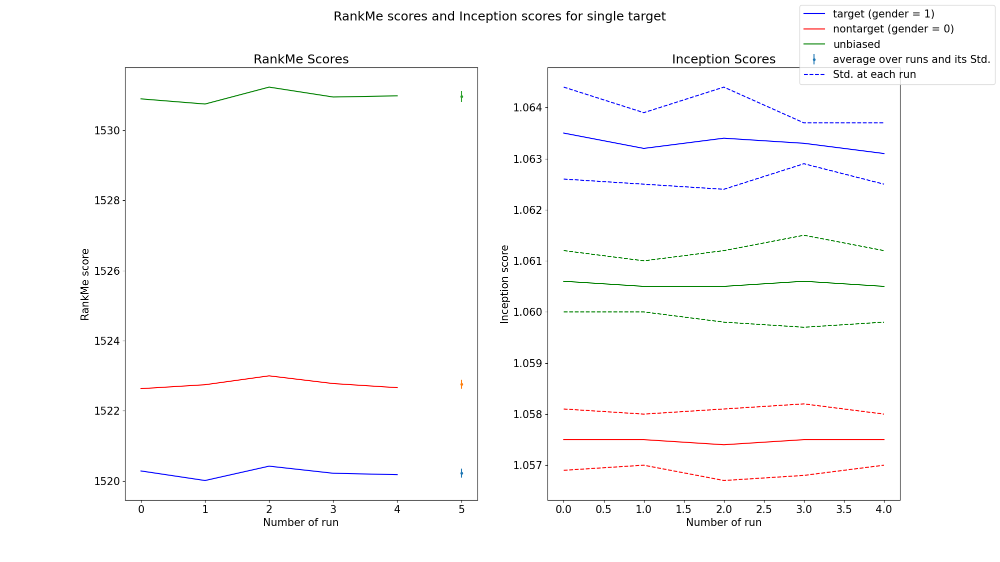

\newpage

```{r setup, include=FALSE}
knitr::opts_chunk$set(echo = TRUE)
```


# 1. Abstract

The field of Generative AI is experiencing a surge in popularity as they can produce text, images, and videos. However, the vast dimensionality of the domain presents challenges when it comes to evaluating the model [@gozalobrizuela2023survey]. Ideally, a model should be capable of generating data across the entire domain from which it was trained, but these models often have the problem of forgetting some of the data (mode-drop) or they generate data outside of the domain (hallucination). These problems may result in biased or false generated data [@gozalobrizuela2023survey].

In the recent research paper from @garrido2023rankme, they introduce RankMe method, a promising solution for assessing representations. This paper inspired this research project where the aim is to investigate the usage of RankMe method on the problem of mode-drop and see if it can be a promising way to detect mode-drop or not. We notice that RankMe can detect the mode-drop in most of the cases where other existing methods may not be able to.


# 2. Introduction and Background

Generative models are one of the most promising approaches towards unsupervised learning techniques in machine learning. They are trained on a large amount of data in some domain (e.g., millions of images, sentences, or sounds, etc.) and then trained to generate data similar to the training data [@openaiGAN]. However, they often suffer from problems like mode-drop and mode-collapse.

Mode-drop is a common problem in Generative models and refers to the reduced variety in the samples produced by a generator. The term has been used interchangeably and has two main interpretations [@oreillyGAN]:

- The generator synthesizes samples with intra-mode variety, but some modes are missing.

- The generator synthesizes samples with inter-mode variety, but each mode lacks variety.

Both interpretations assume that a model has high precision and low recall. The first interpretation refers to low inter-mode recall, that is, when there is a variety in the modes present in the synthesized samples but not all modes are present. The second interpretation refers to low intra-mode recall, that is, when there is a variety within each mode but the overall variety of modes is low[@oreillyGAN].

There have been numerous works addressing these issues. For instance, various training techniques and modifications to the Generative models architecture have been proposed to mitigate mode-drop. Despite these efforts, mode-drop remains a challenging issue in the field of generative AI. [@10.1007/978-3-030-63823-8_77; @yazici2020empirical; @dash2021review]


The paper "RankMe: Assessing the Downstream Performance of Pretrained Self-Supervised Representations by Their Rank" by  @garrido2023rankme focuses on Joint-Embedding Self Supervised Learning (JE-SSL). JE-SSL has seen rapid development but lacks principled guidelines for successful deployment[@chen2020simple; @he2020momentum; @li2022efficient; @zhou2022mugs; @lee2022exploring; @bardes2022vicreg; @caron2021emerging]. This is mainly because JE-SSL does not employ any input reconstruction, thus lacking visual cues of unsuccessful training.

To address this, the authors developed RankMe, a simple unsupervised criterion that indicates the quality of the learned JE-SSL representations by their effective rank. RankMe is computationally friendly and does not require any labels to assess the performance of JE-SSL representations, even on different downstream datasets. Moreover, RankMe does not have any training or hyperparameters to tune. The authors hope that RankMe will facilitate the deployment of JE-SSL towards domains that do not have the opportunity to rely on labels for representations' quality assessment. The problem of mode-drop can be seen as such problems where the generated data has no label to indicate which of the classes and attributes of the training data points are presented in the newly generated data.

It is expected that the representations of the data that are generated from a Generative model get a high score from RankMe method. In other words, the rank of the representations of a biased generated data (due to the mode-drop) should be lower than the rank of the representations of an unbiased generated data (no mode-drop).

# 3. Methods

In order to be able to use RankMe correctly, the formula of the RankMe should be studied first. @garrido2023rankme introduce RankMe formally as the following smooth rank measure where it is originally introduced in [@7098875]:


$$
RankMe(Z)= exp\left( \sum_{k=1}^{min(N, K)} p_k \log p_k  \right)
$$


$$
and  \ \ \ \ p_k = \frac{\sigma_k(Z)}{||\sigma(Z)||_1} + \epsilon
$$


Where $Z$ is a $(N \times K)$ representation matrix of the input data, and the $\sigma_k$ is the $k^{th}$ singular value of the $Z$ matrix. Based on the information from the formula, our problem needs the representation of the generated images. After that the RankMe score can be obtained.

In general the following is the outline of the research project:

1- We need some generated images. For this purpose, the CelebA dataset by @liu2015faceattributes is selected. The dataset consists of 202599 generated images of human faces where each image has 40 binary attributes (such as Male, Attractive, Young, etc.).

2- Having the image dataset, an encoder model is needed to get the representation of the generated images. Based on the results of the RankMe original paper, VicReg [@bardes2022vicreg] and Dino[caron2021emerging] are selected and both are tested for our study. Both representation learning models create a representation vector of 2048 for each input image.

3- Some evaluation metrics should be selected as baselines. In this study Inception score (IS) [@salimans2016improved] is selected. Higher Inception score shows that the Generative model is less prone to mode-drop. notice that high RankMe is better

4- A pipeline for evaluating each of the baseline metrics and RankMe is needed. The pipeline should be able to generate a biased dataset that has some of the attributes missing (have mode-drop), then generates the representations of the images using VicReg or Dino, and finally calculates the scores from each of the metrics. Having binary attributes for CelebA dataset will be useful for excluding or including attributes to biased dataset. 

A Singularity container is also has been made to make the results of this project to be more reproducible.

Before discussing the results of the pipeline, the basic python implementation of the RankMe in PyTorch can be seen as follows:

```{python, eval = FALSE}
## GETTING THE REPRESENTATION VECTORS
with torch.no_grad():
  for batch, x in enumerate(data_loader):
    model_output[(batch*batch_size):((batch+1)*batch_size), :] = model(x)
    
## CALCULATING THE SINGULAR VALUES        
sigma = calc_singular(model_output)
eps = torch.finfo(model_output.dtype).eps

## CALCULATING THE pk IN THE ABOVE FORMULA
p_ks = (sigma / torch.abs(sigma).sum() ) + eps

## CALCULATING THE RankMe SCORE
rank = torch.exp(-torch.sum(p_ks * torch.log(p_ks)))
rank = rank.unsqueeze(0)
```


In order to make sure the RankMe score is implemented correctly, the figure $S11$ from the original paper is re-implemented in the supplement and the result can be seen in Figure 1.


    
<!-- SUGGESTED OUTLINE FOR THE PROJECT: -->
<!-- - Package RankMe as a singularity container -->
<!-- - Identify a good representation learning model for natural images -->
<!-- - Collect one or more datasets used for image generative models which include property information (e.g., CelebA) -->
<!-- - Collect one or more methods for evaluating image generative models (e.g., FID) -->
<!-- - Implement a pipeline which generates a set of representations from a set of images and then calculates the rank using the algorithm proposed by RankMe -->
<!-- - Create a biased dataset from the training data, e.g., by dropping certain attributes s.a. hair color, and  -->
<!-- - Compare the biased dataset to a sample of the training data using the implemented pipeline and the chosen pre-existing method(s) -->


# 4. Results and Discussions

The pipeline is ran with two different settings, once it just creates biased datasets by just dropping "Male" attribute, and once dropping multiple attributes ("Attractive", "High Cheekbones", "Young"). Then, the biased datasets are passed to both VicReg and Dino to get their representations. The RankMe and IS are computed on the obtained representations. Notice that the same pipeline also can be used to calculate the scores for unbiased datasets (where the target attributes are presented equally). Each of the described settings is ran for five times.

First, the results of the RankMe and IS on the setting where only one attribute ("Male") is dropped, can be seen in Figure 2 and Figure 3. As it is evidence in these plots, RankMe score for the unbiased datasets is higher than the datasets that have one attribute dropped. This is while the IS score cannot detect the mode-drop as its scores for all the datasets are very close to each other.





\newpage


Now, the results of the RankMe and IS on the setting where three attributes ("Attractive", "High Cheekbones", "Young") are dropped, can be seen in Figure 4 and Figure 5. In the same way for the Figure 2 and 3, RankMe score can detect the mode-drop while IS score still cannot detect the mode-drop. Notice that in Figure 5, the empirical standard deviation of Dino + RankMe is calculated over 5 runs, and it is visible that the one standard deviations of the scores for "nontarget dataset" and "unbiased dataset" are overlapping. 

<!-- It is worth noting that as the number of dropped attributes increases, the RankMe has a hard task to detect the mode-drop. One explanation can be that the attributes in CelebA are related to each other and by dropping one attribute, some other attributes will -->


Overall, the RankMe can be a new metric for the field of Generative models for detecting the mode-drop as long as the representation network that is chosen is good. In our study case, VicReg and RankMe are more confident at detecting mode-drop compared to the Dino and RankMe.


<!-- - the two different runs  single and multi -->
<!-- - result of single + plot -->
<!-- - result of multi + plot -->


<!-- - table of result -->
<!-- - plot the results next to each other -->
<!-- - see if rankme can do it or no -->
<!-- - see if rankme is better or worse than other scores -->


# 4.2 Suggested Research

One bottleneck in this study is long running time of the pipeline. The RankMe paper mentions that in order to get the best estimation of the rank of the representations, a huge amount of data is needed. In fact, it can be seen in Figure 1 or `S11` of the original RankMe paper that as the amount of data increases the RankMe formula gets closer to the rank of the representation matrix. One suggestion for further studying is to investigate if it is possible to calculate singular values on batches of representations and then using them inside the summation in the above formula or not. Currently, the implemented code, gathers all the representations of the generated dataset and then it calculates the singular values which may not be the most efficient way. However, it should be mentioned that the images of CelebA dataset are large, and hence they could contribute to the long running time. One suggestion is that, CIFAR10 or CIFAR100 by @krizhevsky2009learning could be used in the same way as CelebA is used in this study but with the difference that the CIFAR10 and CIFAR 100 have real data images.

Moreover, there can be more studies on whether RankMe can detect hallucination or mode-collapse or not which are outside of the scopes of this study.

\newpage

# 5. References
